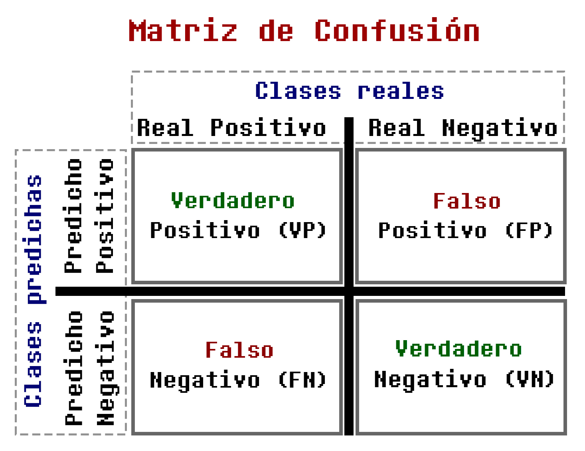

## 🔍 **¿En qué consiste el proyecto?**

Este proyecto consiste en un sistema de **Visión Computacional** que automatiza el análisis dermatológico mediante **Redes Neuronales Convolucionales (CNN)** para identificar anomalías cutáneas. A través del entrenamiento de modelos de **Aprendizaje Profundo (Deep Learning)**, se busca crear una herramienta que funcione como un asistente de diagnóstico preciso. Con el fin de proporcionar una etiqueta diagnóstica preliminar que sirva de apoyo a los profesionales de la salud, permitiendo que la tecnología traduzca patrones visuales complejos en información clínica accionable y confiable. 

Por consiguiente ayuda a reducir la carga operativa de los hospitales y mejorar la precisión del diagnóstico inicial, convirtiendose en una herramienta esencial para modernizar la atención médica preventiva a nivel global.

# **La Ciencia Detrás del Proyecto: Fundamentos Teóricos y Contexto**

---
## 1. El Problema Clínico: Diagnóstico Visual en Dermatología
### Abordaje tradicional del diagnóstico dermatológico

   Previo al desarrollo de este proyecto, el diagnóstico de enfermedades cutáneas se fundamentaba en la inspección visual directa, el uso de criterios clínicos estandarizados como el sistema ABCD (Asimetría, Bordes, Color, Diámetro) y, en casos de sospecha, la confirmación histopatológica mediante biopsia. Los especialistas realizaban la evaluación con dermatoscopios, dispositivos de aumento que permiten visualizar estructuras subepidérmicas no apreciables a simple vista.

  
  &nbsp;
  

### Limitaciones del enfoque tradicional

 El enfoque tradicional presentaba múltiples limitaciones: alta variabilidad inter‑observador (concordancias del 60‑70% en lesiones pigmentadas), dependencia de la experiencia del especialista, barreras de acceso en zonas con escasez de dermatólogos y diagnóstico tardío. El melanoma detectado en etapa temprana alcanza >95% de supervivencia a 5 años, mientras que en etapas avanzadas la supervivencia cae por debajo del 20%.

  
   
  <em>Supervivencia a 5 años según el espesor del melanoma al momento del diagnóstico. Fuente: MSD Connect.</em>

---
## 2. Fundamentos Técnicos: Visión por Computadora y Aprendizaje Profundo
### Redes Neuronales Convolucionales (CNN)

   El sistema se fundamenta en CNN, arquitecturas inspiradas en el córtex visual. Las capas convolucionales detectan patrones jerárquicos: desde bordes y texturas en las primeras capas hasta estructuras dermatoscópicas complejas (redes pigmentarias, glóbulos) en las más profundas. Las capas de pooling reducen dimensionalidad y las capas completamente conectadas realizan la clasificación final.

  
   
  <em>Arquitectura típica de una Red Neuronal Convolucional. Fuente: elaboración propia.</em>

 

### Transfer Learning: Fundamentos y aplicación

   Dada la escasez de datos médicos etiquetados, se emplea transfer learning: se parte de redes pre‑entrenadas en ImageNet. En una primera fase (feature extraction) se congelan las capas convolucionales y se entrenan solo las capas clasificadoras. En una segunda fase (fine‑tuning) se descongelan selectivamente algunas capas para ajustarlas al dominio dermatológico con tasas de aprendizaje reducidas.

  
   
  <em>Proceso de transfer learning: desde una red pre‑entrenada en ImageNet hasta la adaptación al dominio dermatológico. Fuente: ResearchGate.</em>

### Aumento de datos como estrategia de regularización

   Para maximizar la diversidad del entrenamiento se aplican transformaciones sintéticas: rotaciones, reflejos, ajustes de brillo y contraste, distorsiones elásticas. Cada imagen se presenta con variaciones en cada época, reduciendo el sobreajuste.

---
## 3. Métricas de Evaluación en Contexto Clínico

   La evaluación del sistema desarrollado no se limitó a métricas generalistas como la precisión global, sino que se orientó hacia indicadores con significado clínico específico, reconociendo que las consecuencias de los errores diagnósticos no son simétricas.

   
   #### - Sensibilidad (Recall):
   

      Proporción de verdaderos positivos sobre el total de casos positivos reales. Es prioritaria para lesiones malignas como el melanoma, donde un falso negativo puede ser fatal.
      

   
   #### - Especificidad:
   

       Proporción de verdaderos negativos sobre el total de casos negativos reales. Es relevante para evitar biopsias innecesarias y falsas alarmas.
       

   #### - Área bajo la curva ROC (AUC-ROC):
   

      Evalúa el poder discriminatorio del modelo independientemente del umbral de decisión.
     

 
   #### - Valor Predictivo Negativo (VPN):
   

      Proporción de verdaderos negativos sobre el total de negativos clasificados. Es clave en un sistema de triaje, pues indica la confianza cuando el modelo clasifica una lesión como benigna.
      

   

  
   
  <em>Matriz de confusión obtenida en el conjunto de validación.</em>

([Aqui se puede insertar una gráfica de curva ROC]): https://sl.bing.net/izGiltHtSkm

  
   
  <em>Curva ROC y área bajo la curva (AUC) para cada clase.</em>

El sistema se concibe como una herramienta de apoyo diagnóstico, no como sustituto del especialista, permitiendo priorizar casos sospechosos y reducir la carga cognitiva en la atención primaria.

---

## 📚 Referencias

1. Esteva, A., Kuprel, B., Novoa, R. A., Ko, J., Swetter, S. M., Blau, H. M., & Thrun, S. (2017). Dermatologist-level classification of skin cancer with deep neural networks. *Nature*, 542(7639), 115-118.

2. Haenssle, H. A., Fink, C., Schneiderbauer, R., Toberer, F., Buhl, T., Blum, A., ... & Uhlmann, L. (2018). Man against machine: diagnostic performance of a deep learning convolutional neural network for dermal melanoma recognition in comparison to 58 dermatologists. *Annals of Oncology*, 29(8), 1836-1842.

3. Tschandl, P., Codella, N., Akay, B. N., Argenziano, G., Braun, R. P., Cabo, H., ... & Kittler, H. (2020). Comparison of the accuracy of human readers versus machine-learning algorithms for pigmented skin lesion classification: an open, web-based, international, diagnostic study. *The Lancet Digital Health*, 2(1), e28-e37.

4. Brinker, T. J., Hekler, A., Enk, A. H., Berking, C., Haferkamp, S., Hauschild, A., ... & Utikal, J. S. (2019). A convolutional neural network trained with dermoscopic images performed on par with 145 dermatologists in a clinical melanoma classification scenario. *European Journal of Cancer*, 111, 48-54.

